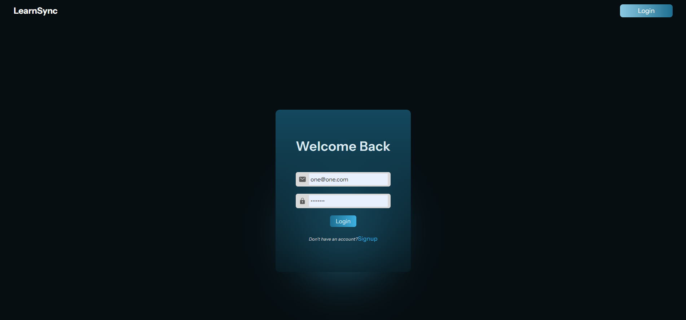
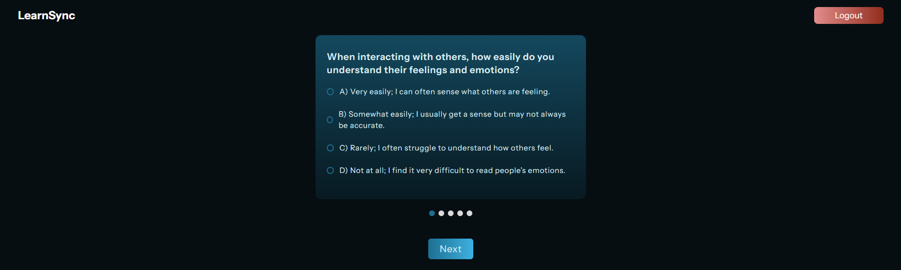
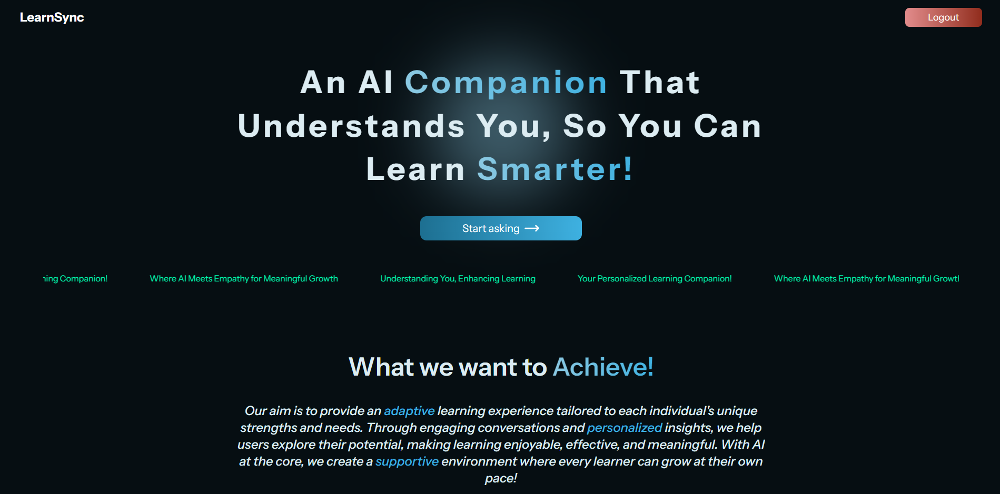
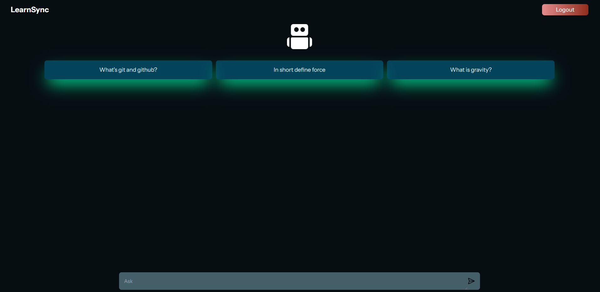
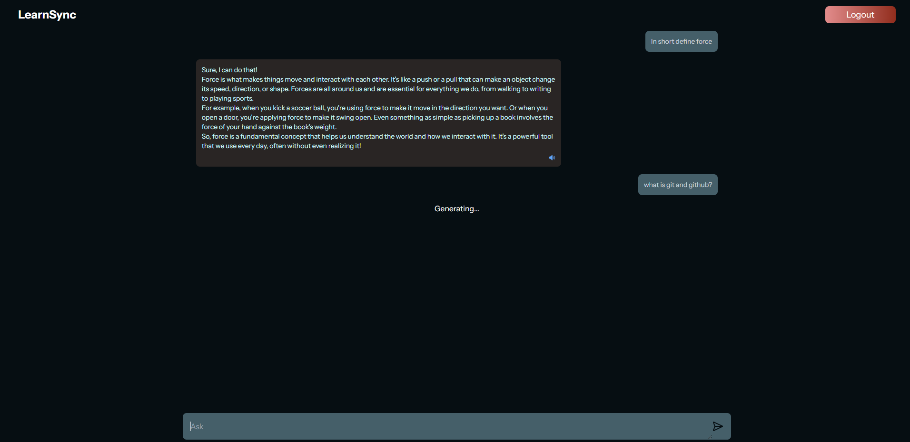

# LearnSync 🧠🤖







LearnSync is an innovative adaptive learning assessment system that incorporates personality tests to detect disorders like ADHD, dyslexia, and autism, followed by personalized AI responses. This project aims to create a more inclusive and effective learning environment for all users.

## 🚀 Live here - https://learn-sync-nine.vercel.app/chat

## 🌟 Features

- 📝 Personality test for detecting learning disorders
- 🤖 AI-powered disorder detection
- 💬 Interactive companion with personalized responses
- 📊 Adaptive learning interface
- 🔐 User authentication and session management
- 🗣️ Text-to-Speech: React Window Synthesizer

## 🛠️ Tech Stack

- Frontend: React ⚛️, Tailwind CSS 🎨, Redux 🔄, Framer Motion 🎭
- Backend: Node.js 🟢, Express 🚂
- Database: MongoDB 🍃
- AI Integration: Cohere API 🧠
- Testing: Postman 📮
- Deploy - Vercel & Render 🚀

## 🚀 Getting Started

### Project Setup

1. Clone the repository:

   ```bash
   git clone https://github.com/Kane-dylan/LearnSync.git
   ```

### Frontend Setup

1. Navigate to client

   ```bash
   cd client
   ```
2. Install dependencies:

   ```bash
   pnpm install
   ```
3. Set up environment variables:
   Create a `.env` file in the client directory and add the following:

   ```
   VITE_API_BASE_URL=http://localhost:5000
   ```
4. Start the development server:

   ```bash
   pnpm run dev
   ```

### Backend Setup

1. Navigate to server

   ```bash
   cd server
   ```
2. Install dependencies:

   ```bash
   pnpm install
   ```
3. Set up environment variables:
   Create a `.env` file in the server directory and add the following:

   ```
   MONGODB_URI=your_mongodb_connection_string
   JWT_SECRET=your_jwt_secret
   COHERE_API_KEY=your_cohere_api_key
   PORT=5000
   CORS_ORIGIN=http://localhost:5173
   ```
4. Start the server:

   ```bash
   pnpm run dev
   ```

## 🌐 API Endpoints

- `POST /api/v1/auth/register`: User authentication
- `POST /api/v1/auth/login`: User authentication
- `GET /api/v1/auth/get-questions`: Fetch personality test questions
- `POST /api/v1/test/submit-answers`: Submit personality test answers
- `POST /api/v1/chat-bot`: Get AI-powered responses

## 🤝 Contributing

We welcome contributions to LearnSync! Please feel free to submit issues, fork the repository and send pull requests!

## 📄 License

This project is licensed under: [MIT licensed](./LICENSE)

## 🙏 Acknowledgements

- [Cohere](https://cohere.ai/) for providing the AI API
- [MongoDB](https://www.mongodb.com/) for the database solution
- [Framer Motion](https://www.framer.com/motion/) for smooth animations
- All contributors who have helped shape LearnSync

---

Happy Learning with LearnSync! 🎓✨
